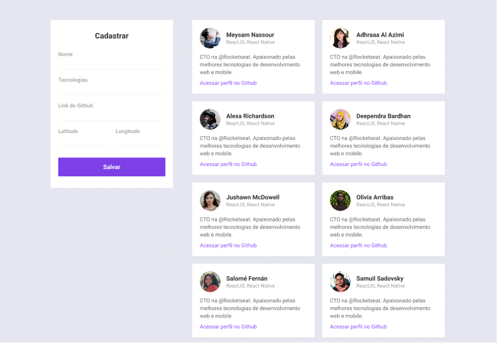
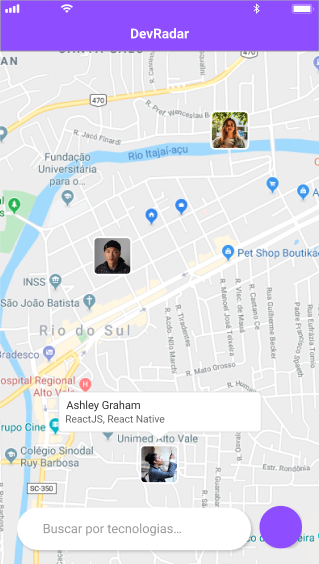

<h1 align="center">
<br>
  
<br>
<br>
DevRadar
</h1>

<p align="center">Aplicação desenvolvida durante a semana Omnistack 10 da <a href="https://rocketseat.com.br" target="_blank">Rocketseat.</a> Tem como objetivo conectar desenvolvedores próximos que utilizam as mesmas tecnologias.</p>

<div>
  
  
</div>

# 📋 Índice

- [Sobre o projeto](#-Sobre-o-projeto)
- [Tecnologias utilizadas](#-Tecnologias-utilizadas)
- [Rodando o projeto](#-Rodando-o-projeto)
  - [Pré-requisitos](#-Pré-requisitos)
  - [Rodando o backend](#-Rodando-o-backend)
  - [Rodando o frontend](#-Rodando-o-frontend)
  - [Rodando o aplicativo mobile](#-Rodando-o-aplicativo-mobile)

## 📃 Sobre o projeto

Projeto desenvolvido durante a semana Omnistack 10 da Rocketseat, onde criamos uma aplicação completa que tem como objetivo conectar desenvolvedores da sua região que tem interesse pelas mesmas tecnologias. A aplicação foi desenvolvida utilizando backend em node, frontend em react e aplicativo mobile em react native.

## 🛠 Tecnologias utilizadas

- ⚛️ **React Js** — Front-end web
- ⚛️ **React Native** — Aplicativo mobile
- 💹 **Node Js** — Back-end
- 📡 **Axios** — Requisições a API
- 🗺 **React native maps** — Mapa no filtro de pontos de coléta no mobile 
- 🌐 **React native webview** — Renderização de webview dentro do app
- 🔌 **Socket.io** - Troca de informações em tempo real entre mobile e web 

## 🚀 Rodando o projeto

A aplicação é dividida em três partes, frontend, mobile e backend, a versão web e o aplicativo mobile precisam que o server esteja sendo executado para funcionar.

### Pré-requisitos

- Git
- NodeJS
- Yarn
- Expo

### 💻 Rodando o server

Clone o repositório

```bash

# Clona o repositório
git clone https://github.com/thiagosprestes/DevRadar-semana-Omnistack-10.git

```

Navegue até a pasta do projeto clonado e execute os comandos abaixo

```bash

# Entra na pasta do backend
cd backend

# Instala as dependências
yarn

# Inicia o backend
yarn start

# Acesse http://localhost:3333 para acessar o servidor caso deseje

```

### 🖥 Rodando o versão frontend

Caso já tenha clonado o repositório basta pular a primeira etapa

```bash

# Clona o repositório
git clone https://github.com/thiagosprestes/DevRadar-semana-Omnistack-10.git
```

Navegue até a pasta do projeto clonado e execute os comandos abaixo

```bash

# Entra na pasta do frontend
cd frontend

# Instala as dependências
yarn

```
Após concluir a instalação das dependências execute o comando

```bash

# Inicia o frontend
yarn start

# Acesse http://localhost:3000 para utilizar a aplicação

```

Com seu smartphone escaneie o QR code que aparece no terminal utilizando o Expo, app que está disponivel na App store e na Play store para iniciar o aplicativo.

### 📱 Rodando o aplicativo mobile

Caso já tenha clonado o repositório basta pular a primeira etapa

```bash

# Clona o repositório
git clone https://github.com/thiagosprestes/DevRadar-semana-Omnistack-10.git

```

Navegue até a pasta do projeto clonado e execute os comandos abaixo

```bash

# Entra na pasta do aplicativo
cd mobile

# Instala as dependências
yarn

```

Após isso, no terminal da pasta mobile execute o comando abaixo

```bash

# Inicia o aplicativo
expo start

```

Com seu smartphone escaneie o QR code que aparece no terminal utilizando o Expo, app que está disponivel na App store e na Play store para iniciar o aplicativo.
